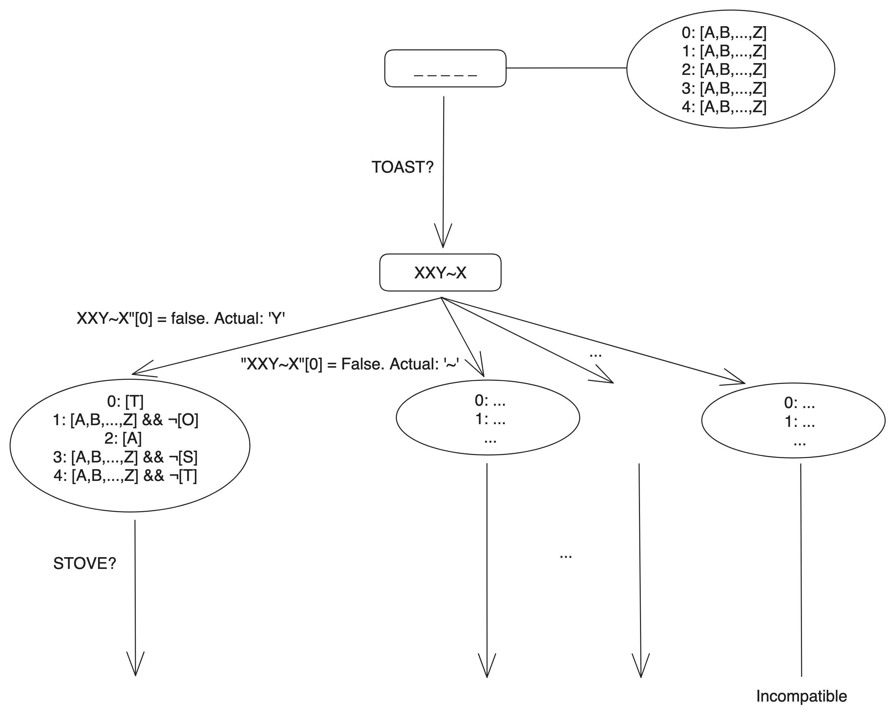

# About
A solver for [Fiction](https://www.allplay.com/board-games/fiction/). Fiction is a wordle
spinoff that adds some trickery to increase the difficulty of the game.

One player acts as the Librarian and chooses a secret word. The other players, as a team,
try to deduce the secret word in ten or fewer guesses. For each incorrect guess,
the Librarian provides a clue indicating the correct or incorrect letters, just like
in Wordle. However, there is a catch! The Librarian must always include exactly one lie in their
clue. 

For help, guessers have the option of using 3 "fact-or-fiction" tokens to challenge exactly
one letter in a Librarian's clue. The librarian must reveal whether the clue for that letter
is true or false.

This program allows you to play as either the Librarian or the guessers against the
computer.

# Prerequisites

- Docker

# Install

Ensure Docker is running. In a terminal window, run the following command:

```
./run.sh build
```

# Play
```
./run.sh start
./run.sh stop
```

The game offers 2 modes: no assistance or fully-automated. In no-assistance mode,
the Librarian or the guesser(s) must manually enter the clues and guesses respectively.
In fully-automated mode, the computer will automatically choose the clue or guess it
deems best.

# Under the hood

The program starts off with a state space of potential letters that could go
into each position in the mystery word. Each time a clue is given for a
guess, the state space splits into multiple branches, one for each possible
lie in the clue. State spaces with contradictory clues or no possible words
are discarded.

The program uses heuristics to pick a clue or a guess. To decide on a clue,
the clue that leaves the most state space branches open is chosen. To decide
on a guess, the opposite is true: the guess that leaves the fewest branches open
is chosen. If there is a tie, the word with the letters that occur most frequently
in the dictionary is chosen.



# Run simulations

Running the following command:

```
./run.sh integration-test 10
```

Causes the solver to be invoked in fully-automated mode several 10 times in succession.
The results are printed to the console.